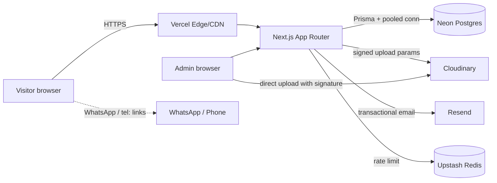

# ARCHITECTURE

## 1. Stack and rationale
| Layer | Choice | Why |
|---|---|---|
| Framework | Next.js (latest stable), App Router, React Server Components | SSR/SSG/ISR, Server Actions, metadata API, Vercel-native |
| Language | TypeScript (strict) | Safety and maintainability |
| Styling | Tailwind CSS + CSS variables for tokens | Fast, consistent, themeable |
| Database | PostgreSQL on Neon (serverless, pooled) | Relational integrity, free tier, branching |
| ORM | Prisma | Typed queries, migrations |
| Auth | Better Auth (email + password, DB sessions, Prisma adapter) | Secure sessions, simple RBAC extension. *Verify against current docs; if unsuitable, record an ADR and use Auth.js.* |
| Media | Cloudinary (signed uploads, `next/image` loader or `next-cloudinary`) | Transformations, CDN, video |
| Email | Resend (React Email templates) | Simple, reliable transactional email |
| Validation | Zod (shared schemas) | One source of truth for client/server |
| Forms | React Hook Form + `@hookform/resolvers` | Reusable form primitives |
| Motion | `motion` (Framer Motion successor) used sparingly | Meaningful animation, reduced-motion aware |
| Charts | Recharts (admin only, dynamically imported) | Dashboard analytics |
| Rate limiting | Upstash Redis (`@upstash/ratelimit`) with in-memory fallback in dev | Edge-friendly |
| Tests | Vitest (unit), Playwright (e2e) | Fast + realistic |
| Hosting | Vercel (app) + Neon (db) + Cloudinary + Resend | Zero-ops |

Dependency policy: prefer platform features; every new dependency needs a one-line justification.

## 2. High-level diagram


## 3. Rendering strategy
| Route group | Strategy | Revalidation |
|---|---|---|
| Home, About, Services, Projects, Gallery, Blog, FAQs | Static + ISR (`revalidate` tags) | On admin save via `revalidateTag` / `revalidatePath` |
| Contact, Estimator, Download | Static shell + client forms + Server Actions | n/a |
| Thank-you pages | Static, `noindex` | n/a |
| Admin `/admin/**` | Dynamic, no cache, `noindex`, auth-gated | n/a |
| `/api/**` | Dynamic route handlers | n/a |

Tag convention: `services`, `service:{slug}`, `projects`, `project:{slug}`, `blog`, `post:{slug}`,
`settings`, `faqs`, `testimonials`, `pages`, `estimator`.

## 4. Layering (strict)
```
UI (app/, components/)          -> only calls server/ via Server Actions or typed fetchers
  └─ Server Actions / Route Handlers (app/**/actions.ts, app/api/**)
        └─ Application services (src/server/services/*)   <- business rules, permission checks
              ├─ Domain logic (src/server/estimator/*)    <- pure functions, no I/O
              └─ Data access (src/lib/db + Prisma)        <- queries only
```
Rules:
1. Components never import Prisma.
2. Pure domain code never imports Next.js, Prisma, or `process.env`.
3. Server Actions: parse input with Zod → authorize → call service → revalidate → return typed result.
4. Cross-cutting (auth, logging, rate-limit, errors) lives in `src/lib/**`.

## 5. Folder structure
```
.
├─ AGENTS.md
├─ docs/                      # PRD, ARCHITECTURE, DATABASE, DESIGN, SECURITY, CODING_STANDARDS, CONTENT, adr/
├─ prisma/
│  ├─ schema.prisma
│  ├─ migrations/
│  └─ seed.ts
├─ public/
├─ src/
│  ├─ app/
│  │  ├─ (site)/              # public layout + pages
│  │  │  ├─ page.tsx
│  │  │  ├─ about/ services/[slug]/ projects/[slug]/ gallery/ blog/[slug]/ faqs/ contact/
│  │  │  ├─ estimate/ (page, thank-you)
│  │  │  └─ download/company-profile/
│  │  ├─ (admin)/admin/
│  │  │  ├─ login/ (public)
│  │  │  └─ (protected)/ dashboard leads quotes estimator projects services testimonials faqs blog gallery media pages seo settings users activity
│  │  ├─ api/ health/ estimate/ leads/ upload/sign/ auth/[...all]/
│  │  ├─ sitemap.ts robots.ts not-found.tsx error.tsx
│  ├─ components/{ui,site,admin,forms,seo}/
│  ├─ lib/
│  │  ├─ db/ (prisma client)
│  │  ├─ auth/ (config, session helpers, permissions)
│  │  ├─ cloudinary/ email/ seo/ validation/ rate-limit/ logger/ env.ts utils.ts
│  ├─ server/
│  │  ├─ estimator/ (types, calculate.ts, rules.ts, validate.ts, *.test.ts)
│  │  ├─ services/ (leads, quotes, projects, content, media, settings, users, activity)
│  │  └─ queries/ (read models for public pages, cached)
│  ├─ config/ (site.ts, navigation.ts, permissions.ts)
│  └─ types/
├─ tests/e2e/
└─ .env.example
```

## 6. Key flows

### 6.1 Estimate + lead submission
1. Client loads `EstimatorConfig` for the chosen service (cached, tag `estimator`).
2. Client calls shared `calculateEstimate(config, answers)` for the live preview.
3. On submit, Server Action `submitQuote`:
   1. rate limit (IP hash + phone), honeypot, Turnstile if enabled
   2. Zod validate contact + answers
   3. **Reload config from DB** and recompute estimate (never trust client numbers)
   4. In one transaction: create `Lead`, `Quote` (with `configSnapshot`, `breakdown`), `LeadStatusHistory`
   5. After commit: send emails (failures logged, never block success)
   6. Redirect to `/estimate/thank-you?ref={publicId}`

### 6.2 Admin save → public update
Admin Server Action → authorize(role) → validate → service writes → `ActivityLog` → `revalidateTag(...)` → UI updates.

### 6.3 Media upload
Admin requests signature (`/api/upload/sign`, role-checked, folder allowlist) → browser uploads directly to Cloudinary → Server Action stores `MediaAsset` (publicId, dims, format, bytes, alt). Alt text mandatory.

## 7. Estimator architecture
- `src/server/estimator/types.ts` — `EstimatorConfig`, `Answers`, `EstimateResult`.
- `calculate.ts` — pure, deterministic, no floats for money (rates `Decimal` at DB boundary converted to numbers in rupees; final amounts rounded to nearest ₹100 and stored as `Int`).
- Rule order: base → option effects → per-unit adds → flat adds → rule engine → zone/floor multipliers → min charge → spread → rounding.
- `validate.ts` — checks answers against config (required, ranges, option membership, visibility).
- Config snapshot = full JSON of the config used; store `estimatorVersion` and a hash.
- Test requirements: table-driven tests incl. edge cases (min area, max area, hidden fields, zero add-ons, multiple multipliers, rounding).

## 8. Auth architecture
- Email + password, DB sessions, HTTP-only secure cookies.
- `getSession()` and `requireRole(...roles)` helpers used in layouts, actions and handlers.
- Next.js request interception (`proxy.ts` in current Next.js; `middleware.ts` in older versions — follow installed version's docs) only does a cheap redirect for unauthenticated `/admin/*`; **real authorization is always re-checked server-side**.
- Roles in `src/config/permissions.ts` as a single permission map (`can(role, 'leads:read')`).

## 9. Error handling & logging
- Server Actions return `{ ok: true, data } | { ok: false, error: { code, message, fieldErrors? } }`.
- Unexpected errors: log (structured JSON, no PII), show generic message, Next.js `error.tsx` boundaries per segment.
- Optional: Sentry (add only if client wants it; ADR).

## 10. Caching & performance
- Public reads wrapped with `unstable_cache`/`use cache` per current Next.js version, tagged.
- `next/image` with Cloudinary loader, explicit sizes, `priority` only for LCP image.
- Fonts via `next/font` (self-hosted, `display: swap`).
- Admin-only heavy libs (Recharts, markdown editor) loaded with dynamic import.
- Avoid client components unless interaction needed; keep them leaf-level.

## 11. Environment variables
| Var | Scope | Notes |
|---|---|---|
| `NEXT_PUBLIC_SITE_URL` | public | canonical URL |
| `DATABASE_URL` | server | Neon **pooled** connection |
| `DIRECT_URL` | server | Neon **direct** connection (migrations) |
| `BETTER_AUTH_SECRET`, `BETTER_AUTH_URL` | server | session signing |
| `CLOUDINARY_CLOUD_NAME`, `CLOUDINARY_API_KEY`, `CLOUDINARY_API_SECRET` | server | secret never exposed |
| `NEXT_PUBLIC_CLOUDINARY_CLOUD_NAME` | public | for image URLs |
| `RESEND_API_KEY`, `EMAIL_FROM`, `LEAD_NOTIFY_TO` | server | |
| `UPSTASH_REDIS_REST_URL`, `UPSTASH_REDIS_REST_TOKEN` | server | rate limit |
| `TURNSTILE_SECRET_KEY`, `NEXT_PUBLIC_TURNSTILE_SITE_KEY` | optional | bot protection |
| `NEXT_PUBLIC_GA_ID` | public | optional |
All validated at boot by `src/lib/env.ts` (Zod); app fails fast if required vars are missing.

## 12. Deployment topology
- `main` → Production (Vercel), PRs → Preview deployments with a **Neon branch** database.
- Migrations run in CI/deploy step with `prisma migrate deploy` using `DIRECT_URL`.
- Production seed is idempotent and only inserts defaults (never overwrites client edits).

## 13. Architecture Decision Records
Store in `docs/adr/NNN-title.md` using: Context · Decision · Consequences · Status.
Initial ADRs to write: 001 Auth library choice · 002 Money representation · 003 Estimator rule engine · 004 Rate limiting provider · 005 Markdown vs rich-text editor.
