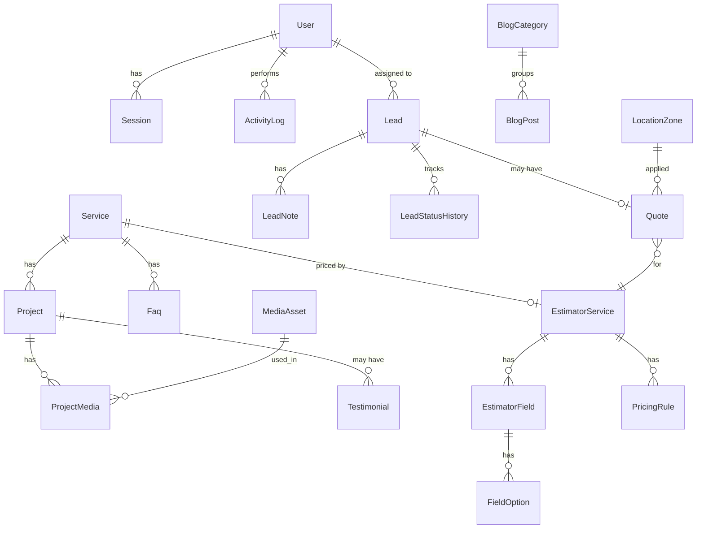

# DATABASE

PostgreSQL on Neon · Prisma ORM. This is the **design baseline**. The agent may refine it
(and must record deviations in an ADR), but must keep the entities, relations and rules below.

## 1. Conventions
- IDs: `String @id @default(cuid())`. Public-facing reference for leads: `publicId` (short, non-guessable).
- Timestamps: `createdAt`, `updatedAt` on every table.
- Soft delete (`deletedAt`) only for `Lead`; content uses `status` (DRAFT/PUBLISHED/ARCHIVED).
- Money: rates are `Decimal(12,2)` in rupees; computed estimate amounts are `Int` rupees (₹5 crore = 50,000,000 fits Int).
- Slugs: unique, lowercase, kebab-case, generated from title, editable, redirect history optional (v1.1).
- Ordering: `sortOrder Int @default(0)` on orderable entities.
- All FKs have explicit `onDelete` behavior; every FK and every filtered/sorted column is indexed.
- JSON columns only for flexible, validated structures (answers, snapshots, section blocks) and always validated with Zod.
- Neon: `DATABASE_URL` = pooled (PgBouncer) for runtime; `DIRECT_URL` = direct for migrations.
- Auth tables (`User`, `Session`, `Account`, `Verification`) are generated per the Better Auth Prisma adapter; **merge** them with the `User` fields below (role, active, etc.).

## 2. ERD (simplified)


## 3. Prisma schema (baseline)
```prisma
generator client {
  provider = "prisma-client-js"   // follow current Prisma docs for the installed major version
}

datasource db {
  provider  = "postgresql"
  url       = env("DATABASE_URL")
  directUrl = env("DIRECT_URL")
}

// ───────────── Enums ─────────────
enum Role            { SUPER_ADMIN ADMIN EDITOR SALES }
enum PublishStatus   { DRAFT PUBLISHED ARCHIVED }
enum ProjectStatus   { COMPLETED ONGOING }
enum LeadStatus      { NEW CONTACTED QUALIFIED CONVERTED CLOSED }
enum LeadType        { QUOTE CONTACT PROJECT_ENQUIRY BROCHURE INSPECTION }
enum ContactEventType{ CALL WHATSAPP }
enum PricingMode     { ESTIMATE INSPECTION_ONLY }
enum AreaUnit        { SQFT RFT UNIT LUMPSUM }
enum FieldType       { SELECT RADIO NUMBER BOOLEAN MULTISELECT }
enum EffectType      { NONE SET_BASE_RATE ADD_PER_UNIT ADD_FLAT MULTIPLY_PERCENT }
enum MediaKind       { IMAGE VIDEO DOCUMENT }

// ───────────── Users & audit (merge with auth-lib generated tables) ─────────────
model User {
  id            String   @id @default(cuid())
  name          String
  email         String   @unique
  emailVerified Boolean  @default(false)
  image         String?
  role          Role     @default(EDITOR)
  isActive      Boolean  @default(true)
  lastLoginAt   DateTime?
  createdAt     DateTime @default(now())
  updatedAt     DateTime @updatedAt

  sessions      Session[]
  accounts      Account[]
  activityLogs  ActivityLog[]
  assignedLeads Lead[]       @relation("LeadAssignee")
  leadNotes     LeadNote[]
  blogPosts     BlogPost[]   @relation("PostAuthor")

  @@index([role, isActive])
}

// Session, Account, Verification: generate with the auth library CLI and keep field names it requires.

model ActivityLog {
  id         String   @id @default(cuid())
  userId     String?
  action     String                // e.g. "project.update"
  entityType String
  entityId   String?
  summary    String?
  diff       Json?                 // sanitized; never store secrets or password hashes
  ipHash     String?
  createdAt  DateTime @default(now())
  user       User?    @relation(fields: [userId], references: [id], onDelete: SetNull)

  @@index([createdAt])
  @@index([entityType, entityId])
  @@index([userId, createdAt])
}

// ───────────── Media ─────────────
model MediaAsset {
  id          String    @id @default(cuid())
  kind        MediaKind @default(IMAGE)
  publicId    String    @unique       // Cloudinary public_id
  url         String                  // secure_url
  format      String?
  width       Int?
  height      Int?
  bytes       Int?
  alt         String                  // required for images (a11y)
  caption     String?
  folder      String?
  uploadedBy  String?
  createdAt   DateTime  @default(now())
  updatedAt   DateTime  @updatedAt

  projectMedia ProjectMedia[]
  @@index([folder, createdAt])
}

// ───────────── Content ─────────────
model Service {
  id           String        @id @default(cuid())
  slug         String        @unique
  title        String
  shortDesc    String
  description  String                    // Markdown
  scopeItems   String[]                  // bullets
  iconKey      String?                   // lucide icon name
  coverId      String?
  status       PublishStatus @default(PUBLISHED)
  isFeatured   Boolean       @default(false)
  sortOrder    Int           @default(0)
  seoTitle     String?
  seoDesc      String?
  createdAt    DateTime      @default(now())
  updatedAt    DateTime      @updatedAt

  projects     Project[]
  faqs         Faq[]
  estimator    EstimatorService?
  @@index([status, sortOrder])
}

model Project {
  id            String        @id @default(cuid())
  slug          String        @unique
  title         String
  summary       String
  description   String?                   // Markdown
  serviceId     String?
  clientName    String?
  showClientName Boolean      @default(false)  // consent toggle
  locationText  String?                   // e.g. "Kharkar Ali, Thane (W)"
  areaSqft      Int?
  floorsText    String?                   // e.g. "Gr. Floor + 5 upper floors"
  scopeText     String?                   // e.g. "PMC & Turnkey"
  year          Int?
  status        ProjectStatus @default(COMPLETED)
  progressPct   Int?                      // for ONGOING
  isFeatured    Boolean       @default(false)
  publishStatus PublishStatus @default(DRAFT)
  sortOrder     Int           @default(0)
  seoTitle      String?
  seoDesc       String?
  createdAt     DateTime      @default(now())
  updatedAt     DateTime      @updatedAt

  service       Service?      @relation(fields: [serviceId], references: [id], onDelete: SetNull)
  media         ProjectMedia[]
  testimonials  Testimonial[]
  @@index([publishStatus, isFeatured, sortOrder])
  @@index([serviceId])
}

model ProjectMedia {
  id         String  @id @default(cuid())
  projectId  String
  mediaId    String
  isCover    Boolean @default(false)
  isBefore   Boolean @default(false)
  isAfter    Boolean @default(false)
  sortOrder  Int     @default(0)
  project    Project    @relation(fields: [projectId], references: [id], onDelete: Cascade)
  media      MediaAsset @relation(fields: [mediaId], references: [id], onDelete: Restrict)
  @@unique([projectId, mediaId])
  @@index([projectId, sortOrder])
}

model GalleryItem {
  id         String   @id @default(cuid())
  mediaId    String
  category   String                      // e.g. "waterproofing"
  title      String?
  sortOrder  Int      @default(0)
  isVisible  Boolean  @default(true)
  createdAt  DateTime @default(now())
  @@index([category, sortOrder])
}

model Testimonial {
  id         String        @id @default(cuid())
  name       String
  roleOrOrg  String?                     // e.g. "Secretary, XYZ CHSL"
  quote      String
  rating     Int?                        // 1-5
  projectId  String?
  status     PublishStatus @default(DRAFT)
  sortOrder  Int           @default(0)
  createdAt  DateTime      @default(now())
  updatedAt  DateTime      @updatedAt
  project    Project?      @relation(fields: [projectId], references: [id], onDelete: SetNull)
  @@index([status, sortOrder])
}

model Faq {
  id         String        @id @default(cuid())
  question   String
  answer     String                      // Markdown (sanitized)
  serviceId  String?                     // null = general FAQ
  status     PublishStatus @default(PUBLISHED)
  sortOrder  Int           @default(0)
  createdAt  DateTime      @default(now())
  updatedAt  DateTime      @updatedAt
  service    Service?      @relation(fields: [serviceId], references: [id], onDelete: SetNull)
  @@index([serviceId, status, sortOrder])
}

model TeamMember {
  id            String   @id @default(cuid())
  name          String
  qualification String?
  designation   String
  experienceYrs Int?
  bio           String?
  photoId       String?
  sortOrder     Int      @default(0)
  isVisible     Boolean  @default(true)
  createdAt     DateTime @default(now())
  updatedAt     DateTime @updatedAt
}

model BlogCategory {
  id    String     @id @default(cuid())
  slug  String     @unique
  name  String
  posts BlogPost[]
}

model BlogPost {
  id           String        @id @default(cuid())
  slug         String        @unique
  title        String
  excerpt      String
  content      String                    // Markdown, sanitized on render
  coverId      String?
  categoryId   String?
  authorId     String?
  status       PublishStatus @default(DRAFT)
  publishedAt  DateTime?                 // supports scheduled publishing
  readingMins  Int?
  seoTitle     String?
  seoDesc      String?
  createdAt    DateTime      @default(now())
  updatedAt    DateTime      @updatedAt
  category     BlogCategory? @relation(fields: [categoryId], references: [id], onDelete: SetNull)
  author       User?         @relation("PostAuthor", fields: [authorId], references: [id], onDelete: SetNull)
  @@index([status, publishedAt])
  @@index([categoryId])
}

model PageSection {
  id        String   @id @default(cuid())
  pageKey   String                      // "home", "about"
  sectionKey String                     // "hero", "stats", "cta"
  content   Json                        // validated by per-section Zod schema
  sortOrder Int      @default(0)
  isVisible Boolean  @default(true)
  updatedAt DateTime @updatedAt
  @@unique([pageKey, sectionKey])
}

model PageSeo {
  id          String   @id @default(cuid())
  path        String   @unique          // "/", "/about", "/services"
  title       String?
  description String?
  ogImageId   String?
  canonical   String?
  noIndex     Boolean  @default(false)
  updatedAt   DateTime @updatedAt
}

model SiteSetting {                      // singleton row id = "singleton"
  id             String   @id @default("singleton")
  businessName   String
  tagline        String?
  phones         String[]
  email          String?
  whatsappNumber String?
  whatsappMessage String?
  address        String?
  mapEmbedUrl    String?
  businessHours  Json?
  socials        Json?                  // { facebook, instagram, linkedin, youtube, justdial }
  credentials    Json?                  // [{ label, value }]  e.g. MSME reg. no.
  brochureMediaId String?
  notifyEmails   String[]
  foundedYear    Int      @default(2003)
  updatedAt      DateTime @updatedAt
}

// ───────────── Leads ─────────────
model Lead {
  id           String     @id @default(cuid())
  publicId     String     @unique        // e.g. VK-7F3K9Q (shown to visitor)
  type         LeadType
  status       LeadStatus @default(NEW)
  name         String
  phone        String                     // normalized +91XXXXXXXXXX
  email        String?
  location     String?
  message      String?
  consent      Boolean    @default(false)
  consentAt    DateTime?
  sourcePage   String?
  referrer     String?
  utmSource    String?
  utmMedium    String?
  utmCampaign  String?
  utmTerm      String?
  utmContent   String?
  deviceType   String?
  ipHash       String?
  isDuplicate  Boolean    @default(false)
  assignedToId String?
  followUpAt   DateTime?
  deletedAt    DateTime?
  createdAt    DateTime   @default(now())
  updatedAt    DateTime   @updatedAt

  assignedTo   User?      @relation("LeadAssignee", fields: [assignedToId], references: [id], onDelete: SetNull)
  notes        LeadNote[]
  history      LeadStatusHistory[]
  quote        Quote?

  @@index([status, createdAt])
  @@index([type, createdAt])
  @@index([phone])
  @@index([assignedToId, status])
  @@index([deletedAt])
}

model LeadNote {
  id        String   @id @default(cuid())
  leadId    String
  authorId  String?
  body      String
  createdAt DateTime @default(now())
  lead      Lead     @relation(fields: [leadId], references: [id], onDelete: Cascade)
  author    User?    @relation(fields: [authorId], references: [id], onDelete: SetNull)
  @@index([leadId, createdAt])
}

model LeadStatusHistory {
  id         String     @id @default(cuid())
  leadId     String
  fromStatus LeadStatus?
  toStatus   LeadStatus
  changedBy  String?
  createdAt  DateTime   @default(now())
  lead       Lead       @relation(fields: [leadId], references: [id], onDelete: Cascade)
  @@index([leadId, createdAt])
}

model ContactEvent {
  id         String           @id @default(cuid())
  type       ContactEventType
  pagePath   String
  context    String?                      // e.g. project slug
  ipHash     String?
  createdAt  DateTime         @default(now())
  @@index([type, createdAt])
}

// ───────────── Estimator ─────────────
model EstimatorService {
  id             String      @id @default(cuid())
  serviceId      String?     @unique
  slug           String      @unique
  name           String
  description    String?
  pricingMode    PricingMode @default(ESTIMATE)
  unit           AreaUnit    @default(SQFT)
  baseRate       Decimal     @db.Decimal(12, 2)      // ₹ per unit
  minCharge      Decimal     @default(0) @db.Decimal(12, 2)
  minArea        Int         @default(100)
  maxArea        Int         @default(100000)
  spreadPercent  Decimal     @default(10) @db.Decimal(5, 2)   // low/high band
  roundTo        Int         @default(100)           // round to nearest ₹
  disclaimer     String?
  version        Int         @default(1)             // bump on publish
  isActive       Boolean     @default(true)
  sortOrder      Int         @default(0)
  createdAt      DateTime    @default(now())
  updatedAt      DateTime    @updatedAt

  service        Service?    @relation(fields: [serviceId], references: [id], onDelete: SetNull)
  fields         EstimatorField[]
  rules          PricingRule[]
  quotes         Quote[]
  @@index([isActive, sortOrder])
}

model EstimatorField {
  id                 String    @id @default(cuid())
  estimatorServiceId String
  key                String                      // stable machine key, e.g. "floors"
  label              String
  helpText           String?
  type               FieldType
  required           Boolean   @default(true)
  sortOrder          Int       @default(0)
  min                Int?
  max                Int?
  step               Int?
  defaultValue       String?
  showIf             Json?                       // { key, op: "eq"|"in"|"gt"|"lt", value }
  // for NUMBER fields: optional effect per unit of the number
  effectType         EffectType @default(NONE)
  effectValue        Decimal?   @db.Decimal(12, 2)
  isActive           Boolean   @default(true)

  estimatorService   EstimatorService @relation(fields: [estimatorServiceId], references: [id], onDelete: Cascade)
  options            FieldOption[]
  @@unique([estimatorServiceId, key])
  @@index([estimatorServiceId, sortOrder])
}

model FieldOption {
  id          String     @id @default(cuid())
  fieldId     String
  value       String                          // stable machine value
  label       String
  description String?
  effectType  EffectType @default(NONE)
  effectValue Decimal?   @db.Decimal(12, 2)   // rate, amount or percent depending on effectType
  sortOrder   Int        @default(0)
  isActive    Boolean    @default(true)
  field       EstimatorField @relation(fields: [fieldId], references: [id], onDelete: Cascade)
  @@unique([fieldId, value])
  @@index([fieldId, sortOrder])
}

model LocationZone {
  id            String   @id @default(cuid())
  name          String                      // "Thane", "Mumbai Suburbs", "Outside MMR"
  keywords      String[]                    // matched against user-selected area
  multiplierPct Decimal  @default(0) @db.Decimal(5, 2)  // +/- percent
  isActive      Boolean  @default(true)
  sortOrder     Int      @default(0)
  quotes        Quote[]
}

model PricingRule {
  id                 String     @id @default(cuid())
  estimatorServiceId String
  name               String
  order              Int        @default(0)
  condition          Json                    // { all: [{ key, op, value }] } validated by Zod
  effectType         EffectType
  effectValue        Decimal    @db.Decimal(12, 2)
  isActive           Boolean    @default(true)
  estimatorService   EstimatorService @relation(fields: [estimatorServiceId], references: [id], onDelete: Cascade)
  @@index([estimatorServiceId, order])
}

model Quote {
  id                 String   @id @default(cuid())
  leadId             String   @unique
  estimatorServiceId String
  locationZoneId     String?
  areaValue          Int
  answers            Json                    // validated user answers
  breakdown          Json                    // line items shown to user
  configSnapshot     Json                    // full config used
  configVersion      Int
  configHash         String
  lowAmount          Int                     // ₹
  highAmount         Int                     // ₹
  createdAt          DateTime @default(now())

  lead               Lead             @relation(fields: [leadId], references: [id], onDelete: Cascade)
  estimatorService   EstimatorService @relation(fields: [estimatorServiceId], references: [id], onDelete: Restrict)
  locationZone       LocationZone?    @relation(fields: [locationZoneId], references: [id], onDelete: SetNull)
  @@index([estimatorServiceId, createdAt])
}
```

## 4. Integrity rules
1. A `Quote` always has a `Lead`; never create a quote without lead capture.
2. `MediaAsset` cannot be deleted while referenced (Restrict) — admin UI must show usage.
3. `EstimatorService.version` increments whenever any field/option/rule under it changes (done in the service layer inside a transaction).
4. A published `Project`/`Service`/`BlogPost` requires: title, slug, summary/excerpt, at least one image (except blog).
5. Phone numbers are normalized to E.164 (`+91XXXXXXXXXX`) before storing.
6. Lead duplicates: when a lead with the same phone exists within 30 days, set `isDuplicate = true` (still store).
7. Admin deletes of leads are soft deletes (`deletedAt`). Hard purge only via documented retention job.
8. `ActivityLog` is append-only; no update/delete endpoints.

## 5. Seed plan (`prisma/seed.ts`, idempotent via `upsert`)
1. SiteSetting (from `CONTENT.md`: name, tagline, phones, founded 2003; `TODO(client)` for address/email).
2. 11 Services with slugs, descriptions, scope bullets.
3. TeamMember ×4; credentials (MSME, workmen's compensation insurance).
4. Projects ×6 (3 construction + 3 repair audits) with `showClientName = false`, status DRAFT until media attached.
5. FAQs (≥ 12) general + per service.
6. Estimator: `EstimatorService` for ESTIMATE services with **placeholder rates clearly labelled "PLACEHOLDER — client to confirm"**; `INSPECTION_ONLY` for repair/rehab/piling/PMC; location zones; sample rules.
7. PageSection defaults (home hero/stats/cta, about).
8. First `SUPER_ADMIN` from env (`SEED_ADMIN_EMAIL`, `SEED_ADMIN_PASSWORD`) — only if no users exist; force password change on first login.

## 6. Migration workflow
```bash
npx prisma migrate dev --name <change>   # local (uses DIRECT_URL)
npx prisma migrate deploy                # CI / production
npx prisma generate
```
- Never edit applied migrations. Destructive changes need a two-step migration (add → backfill → drop).
- Use a **Neon branch** per preview/test environment.

## 7. Backups & retention
- Neon point-in-time restore enabled; document restore procedure in `docs/RUNBOOK.md`.
- Lead retention: default 24 months, then anonymize (name/phone/email) — configurable.
- Export leads to CSV monthly (admin action) as an additional backup.
